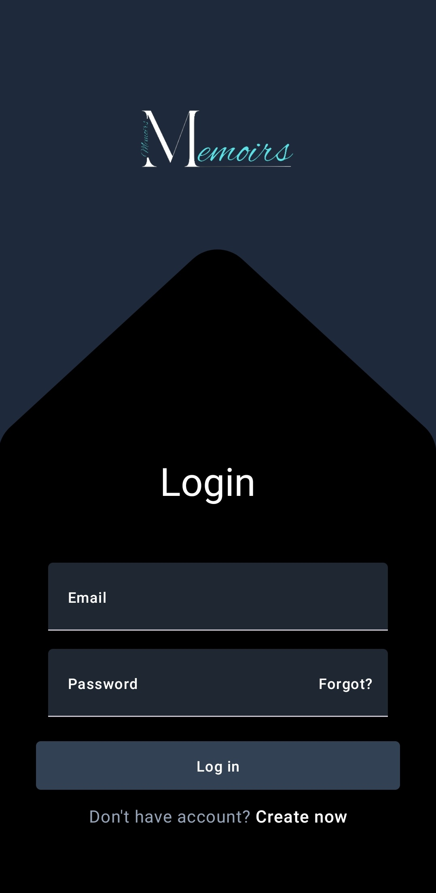
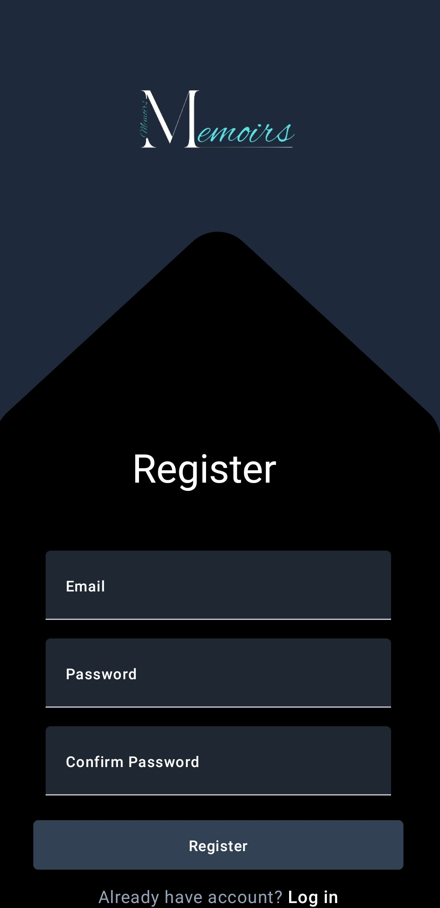
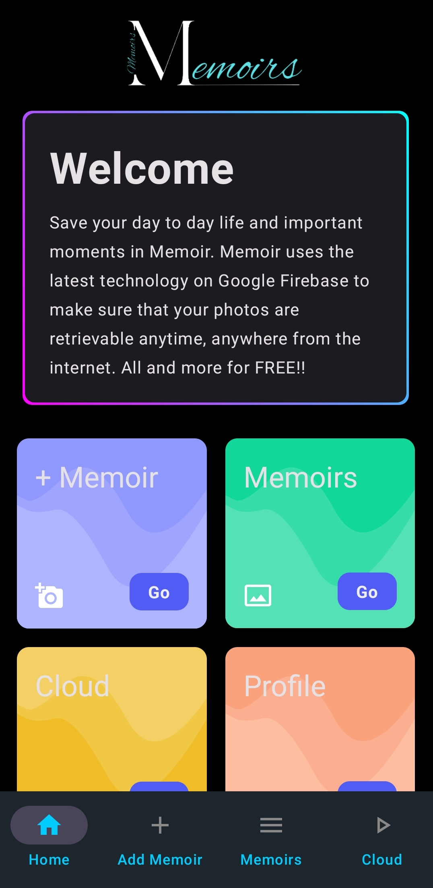
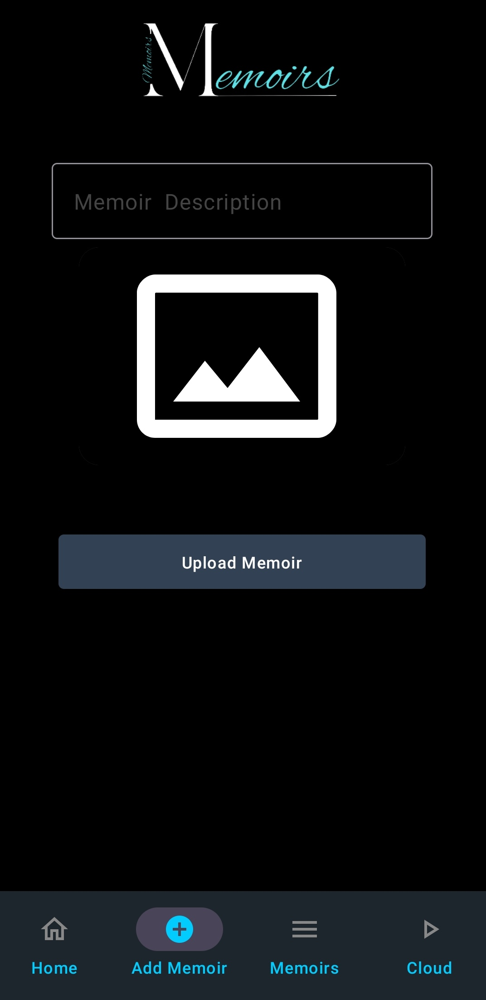
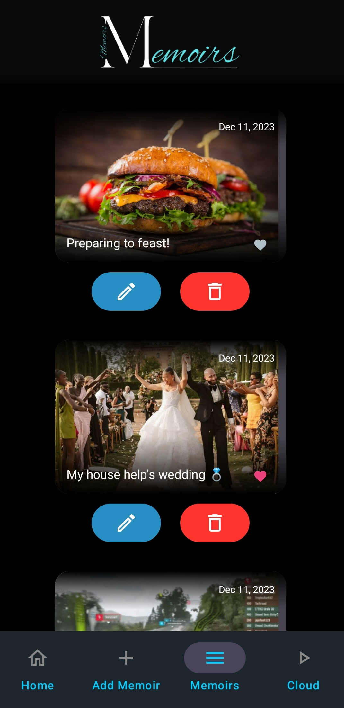

# memoir

 
<!--  

 -->

  
  
  
  
  

## Description

This project is a simple android application using MVVM architecture, Jetpack Compose.
The application is a picture storing app that saves the images online in firebase.
